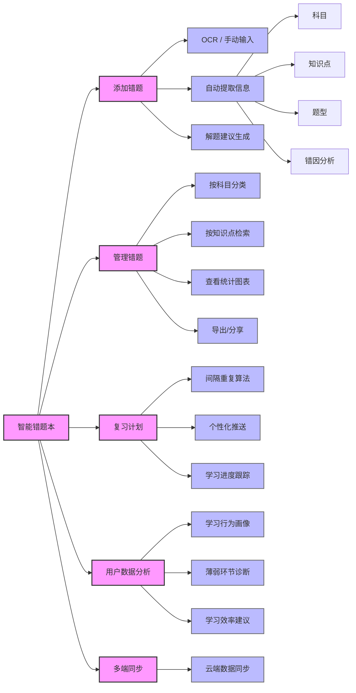

# 📚 智能错题本 Smart Error Notebook

> **让每一次错误，都成为进步的阶梯。**

## 🌟 项目简介

**智能错题本** 是一款基于人工智能与学习科学设计的个人化学习管理工具。它不仅能帮你高效记录错题，更能通过数据分析、智能复习提醒和个性化建议，帮助你精准定位薄弱知识点，实现“学得准、记得牢、考得好”。

本项目核心围绕三大模块构建：**错题录入 → 错题管理 → 智能复习**，并辅以用户行为分析与学习建议，打造闭环式学习体验。

---

## 🧭 功能架构图

---

## ✨ 核心功能详解

### 1️⃣ 添加错题（Add Error Questions）

- **OCR 识别**：支持拍照或上传图片，自动识别题目文字。
- **AI 辅助解析**：
  - 自动标注所属**科目**、**知识点**
  - 识别**题型**（选择、填空、计算、论述等）
  - 分析**错误原因**（粗心、概念不清、方法错误等）
  - 生成**解题建议**或推荐类似例题
- **手动编辑**：支持自由补充笔记、标签、优先级

---

### 2️⃣ 管理错题（Manage Errors）

- **多维度分类**：
  - 按**科目**（数学、物理、英语...）
  - 按**知识点**（函数、力学、语法...）
  - 按**错误类型**、**难度等级**、**时间标签**
- **智能搜索与筛选**：
  - 支持关键词、标签、日期范围组合查询
  - 可视化数据面板（错题分布热力图、高频错点TOP5）
- **导出与同步**：
  - 导出 PDF/Word 错题集
  - 支持云端同步（跨设备访问）

---

### 3️⃣ 智能复习（Smart Review）

- **间隔重复系统（Spaced Repetition）**：
  - 自动推送待复习题目，避免“学完就忘”
- **个性化复习计划**：
  - 根据你的掌握程度、考试日期、学习节奏生成每日任务
  - 高频错题优先强化，低频题适度回顾
- **学习报告**：
  - 每周/每月生成学习总结报告
  - 包含进步趋势、知识盲区、效率评估

---

### 4️⃣ 用户数据分析 & 学习建议（User Analytics & Recommendations）

- **学习画像**：
  - 统计各科错题量、正确率变化趋势
  - 识别你的“易错题型”、“知识薄弱区”
- **智能建议引擎**：
  - 推荐针对性练习题或视频课程
  - 提醒“该复习了！”、“这个知识点你已掌握80%”
- **目标追踪**：
  - 设置学习目标（如“一周内攻克三角函数”）
  - 进度可视化 + 成就徽章激励

---

## 🛠️ 技术栈

- **前端**：Vue + TypeScript + TailwindCSS
- **后端**：Rust + Tauri + SQLite
- **云端**：Flask + MySQL

---

## 🚀 未来规划

---

## 🙏 致谢

感谢以下开源项目与社区的贡献：

### MIT / ISC 协议

- **[Vue](https://github.com/vuejs/core)** (MIT) — 前端框架
- **[Vue Router](https://github.com/vuejs/router)** (MIT) — 前端路由
- **[KaTeX](https://github.com/KaTeX/KaTeX)** (MIT) — 数学公式渲染
- **[marked](https://github.com/markedjs/marked)** (MIT) — Markdown 解析
- **[html2canvas](https://github.com/niklasvh/html2canvas)** (MIT) — 截图导出
- **[jsPDF](https://github.com/parallax/jsPDF)** (MIT) — PDF 生成
- **[dom-to-image-more](https://github.com/1904labs/dom-to-image-more)** (MIT) — DOM 转图片
- **[uuid](https://github.com/uuidjs/uuid)** (MIT) — UUID 生成
- **[Lucide](https://github.com/lucide-icons/lucide)** (ISC) — 图标库
- **[Tauri](https://github.com/tauri-apps/tauri)** (MIT / Apache-2.0) — 跨平台框架
- **[tauri-plugin-share](https://github.com/lindongchen/tauri-plugin-share)** (MIT) — 移动端分享，Copyright (c) 2025 lindongchen

### BSD-3-Clause

- **[highlight.js](https://github.com/highlightjs/highlight.js)** — 代码语法高亮

### 专有许可 (No Charge)

- **[GSAP](https://gsap.com)** (Standard 'No Charge' License) — 动画引擎，由 Webflow 赞助支持，在不对最终用户收费的前提下可免费使用

### Rust 生态

- **[Tokio](https://github.com/tokio-rs/tokio)** (MIT) — 异步运行时
- **[Serde](https://github.com/serde-rs/serde)** (MIT / Apache-2.0) — 序列化框架
- **[SeaORM](https://github.com/SeaQL/sea-orm)** (MIT / Apache-2.0) — ORM 框架
- **[Chrono](https://github.com/chronotope/chrono)** (MIT / Apache-2.0) — 日期时间库

感谢所有开源贡献者的辛勤付出 ❤️
