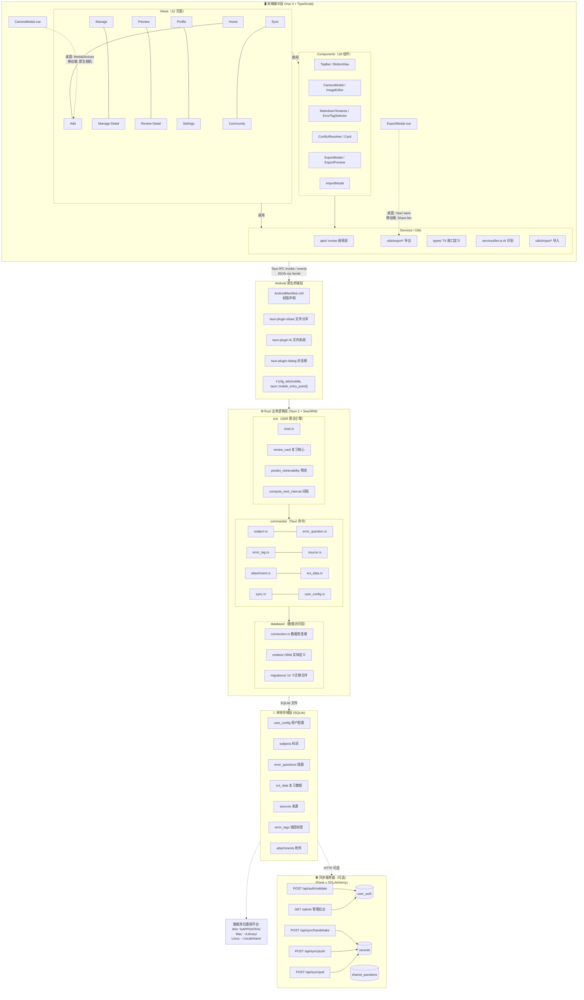
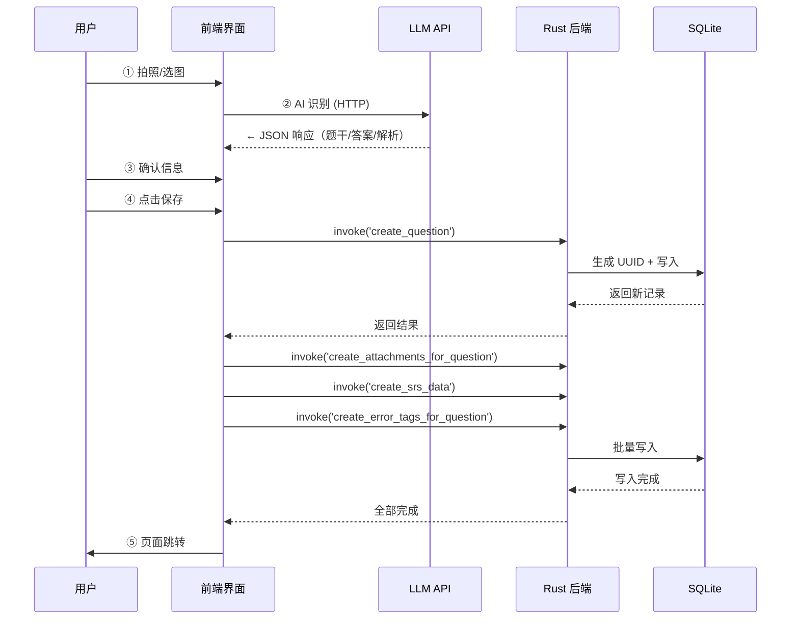
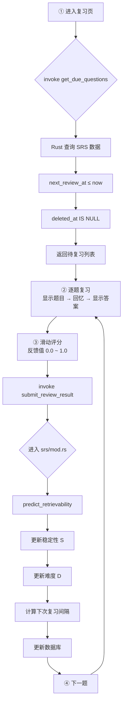
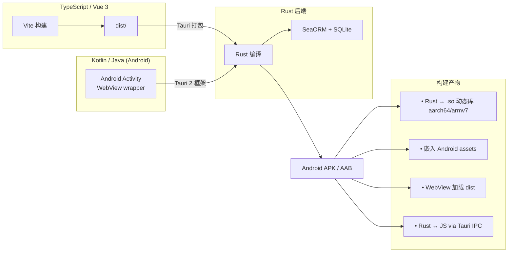
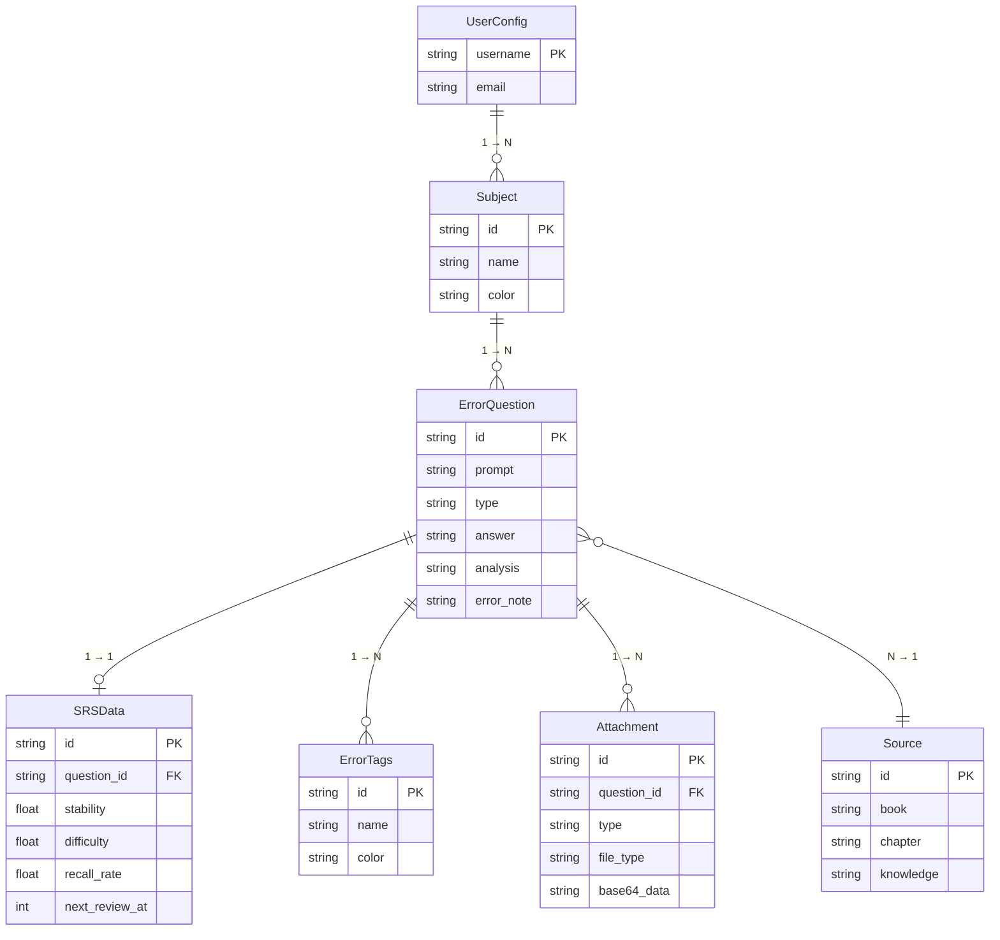
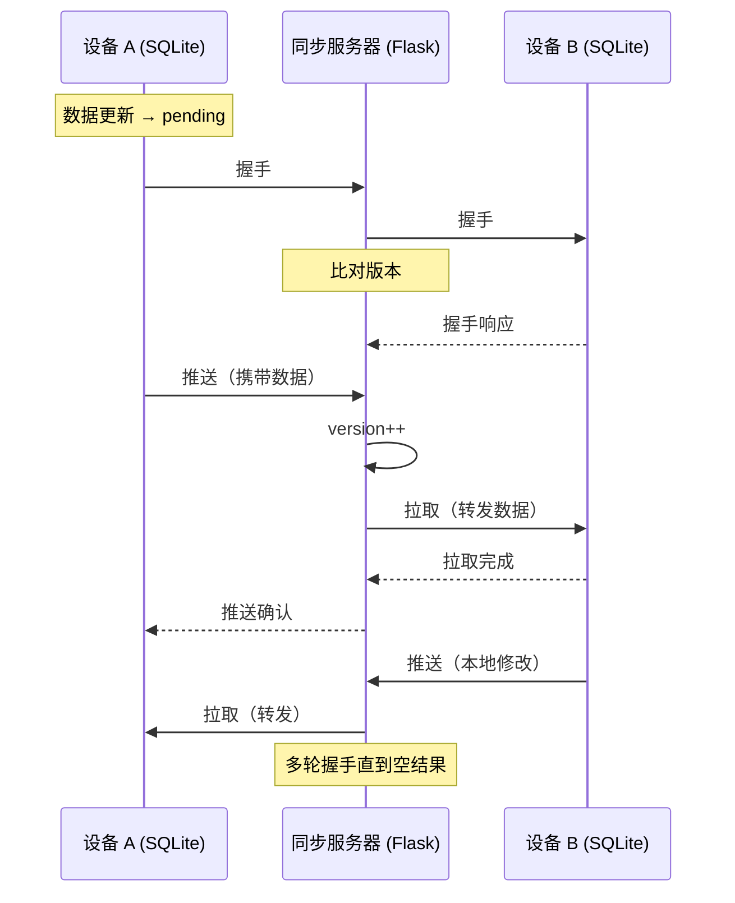

# Smart Error Notebook 架构设计

> 本文档描述项目的整体架构、分层设计、关键数据流与设计决策。

---

## 📑 目录

1. [总体架构](#-总体架构)
2. [数据流详解](#-数据流详解)
3. [目录详解](#-目录详解)
4. [关键设计决策](#-关键设计决策)
5. [数据结构关系](#-数据结构关系)
6. [同步架构](#-同步架构)
7. [技术债与 FIXME](#-技术债与-fixme)

---

## 🏛️ 总体架构

本项目采用 **三层架构**：前端展示层 → Rust 业务逻辑层 → 本地存储层，外加可选的同步服务器层。

---

## 🔄 数据流详解

### 典型场景：添加一道错题

### 典型场景：执行一次复习

---

## 📂 目录详解

### 前端 (`src/`)

| 目录 | 职责 | 关键约定 |
|------|------|----------|
| `views/` | 页面组件，对应路由 | 每个 `.vue` 一个页面，命名 PascalCase |
| `components/` | 可复用 UI 组件 | 无业务逻辑，通过 props/events 通信 |
| `apis/` | `invoke()` 封装层 | 每个 Rust 实体对应一个文件 |
| `services/` | 状态管理 + 业务服务 | LLM 服务为单例模式 |
| `utils/` | 纯函数工具 | 不含副作用 |
| `types/` | TypeScript 接口定义 | 前后端契约 |
| `directives/` | Vue 自定义指令 | — |
| `styles/` | 全局样式 + 主题变量 | 主题通过 CSS 变量切换 |

### Rust 后端 (`src-tauri/src/`)

| 目录 | 职责 | 关键约定 |
|------|------|----------|
| `commands/` | Tauri 命令处理器 | 每个文件 ≈ 一个实体，函数标注 `#[tauri::command]` |
| `database/entities/` | SeaORM 实体 | `#[derive(DeriveEntityModel)]` |
| `database/migrations/` | 数据库迁移 | 命名 `mYYYYMMDD_NNNNNN_desc.rs` |
| `srs/` | 核心复习算法 | 纯函数，不依赖 Tauri/数据库 |

### 同步服务器 (`server/`)

| 文件 | 职责 |
|------|------|
| `app.py` | Flask 应用，包含所有 API 路由和数据模型 |
| `requirements.txt` | Python 依赖 |
| `templates/admin.html` | 管理后台页面 |

---

## 📱 移动端架构

### Android 构建管线

### 移动端与桌面端的差异点

| 维度 | 桌面端 | Android 端 |
|------|--------|------------|
| **窗口** | 独立窗口 (800×600) | 全屏 Activity，无窗口概念 |
| **文件交互** | Tauri save/open dialog | Tauri Dialog Plugin + Web Share API |
| **分享** | 隐藏分享按钮 | `navigator.share()` 调用系统分享 |
| **相机** | `navigator.mediaDevices.getUserMedia()` | 同上（Tauri 桥接） |
| **safe-area** | 不生效 | 顶部/底部留白避开状态栏和导航栏 |
| **数据库路径** | AppData 目录 | Android 内部存储 |
| **构建工具** | cargo + system deps | Gradle + Android NDK 交叉编译 |

### 移动端特有的前端代码

| 文件 | 移动端逻辑 |
|------|-----------|
| `ExportModal.vue` | `navigator.userAgent` 判断移动端，显示分享按钮 |
| `exportFile.ts` | 移动端走 `navigator.share()` 分享文件 |
| `shareContent.ts` | Tauri Share Plugin 调用 Android Intent |
| `FilterNav.vue` | 窗口宽度 ≤ 768px 时切换为底部弹出样式 |
| `App.vue` + `TopBar.vue` + `CameraModal.vue` + `ImageEditor.vue` | `safe-area-inset` 适配刘海屏/挖孔屏 |

---

## 🎯 关键设计决策

### 1. 为什么用 SQLite 而非其他数据库？

**决策**：本地存储使用 SQLite，通过 SeaORM 访问。

**理由**：
- **零配置**：用户无需安装数据库服务，开箱即用
- **单文件**：备份、迁移、同步都极为简单
- **嵌入式中等负载**：单用户场景 SQLite 性能绰绰有余
- **SeaORM** 提供了类型安全和迁移管理，未来切换到 PostgreSQL/MySQL 只需改连接字符串

### 2. SRS 为什么用 SDR 模型而非 SM-2？

**决策**：采用基于连续反馈的 SDR（Stability-Difficulty-Retrievability）模型。

**理由**：
- **连续反馈**：SM-2 只有 0-5 六个离散等级，SDR 支持 [0, 1] 连续值
- **自适应难度**：SDR 有独立的难度参数 $D$，会随历史反馈慢变
- **遗忘曲线拟合**：$R = e^{-t/S}$ 更符合记忆科学中的指数遗忘曲线
- **调参灵活**：所有参数（学习率、初始值、边界）都在 `config` 模块集中管理

详见 [SRS 算法文档](SRS_ALGORITHM.md)

### 3. 同步协议为什么设计为离线优先 + 握手模式？

**决策**：采用"离线优先 + 双向握手"的同步策略。

**理由**：
- **离线可用**：用户在地铁/无网络环境下可正常使用，有网时自动同步
- **版本向量**：每条记录有独立 version，握手时只需传轻量 header
- **冲突可解**：支持手动解决多设备同时修改同一记录的冲突
- **通用性强**：同一套协议适用于 7 张业务表

详见 [同步协议文档](SYNC_PROTOCOL.md)

### 4. 为什么用 Tauri 而非 Electron？

- **体积更小**：安装包约 10MB（Electron 约 150MB+）
- **性能更好**：Rust 后端比 Node.js 后端更高效
- **内存占用低**：Tauri 约 50MB，Electron 约 200MB+
- **安全性**：Rust 的内存安全保证 + Tauri 的权限模型

### 5. LLM 为什么设计为可配置的通用接口？

- 用户可以选择任意兼容 OpenAI API 的服务（OpenAI、DeepSeek、本地 Ollama 等）
- 不做供应商锁定
- 配置存储在 localStorage，不经过后端

---

## 📊 数据结构关系

| 表 | 记录数级（单用户） | 说明 |
|----|-------------------|------|
| user_config | 1 | 单用户配置 |
| subjects | 10-50 | 科目 |
| error_questions | 100-5000 | 错题主表 |
| srs_data | = 错题数 | 一对一关系 |
| sources | 50-500 | 来源 |
| error_tags | 200-2000 | 错因标签（多对多） |
| attachments | 100-2000 | 图片附件 |

---

## 🔗 同步架构

同步功能是本项目最复杂的部分，详见 [同步协议文档](SYNC_PROTOCOL.md)。

核心设计要点：

### 关键特性

1. **每记录版本号**：每条数据有独立 `version` 字段，单调递增
2. **延迟冲突检测**：只有真正发生编辑冲突时才提示，而非锁表
3. **软删除**：删除标记传播到所有设备后才真正清理

---

## 📈 性能考虑

| 场景 | 当前方案 | 优化空间 |
|------|----------|----------|
| 图片存储 | base64/BLOB 存入 SQLite | 大文件可改为文件系统存储 |
| 大数据量查询 | 基础分页 (limit/offset) | 可加游标分页 |
| 复习队列 | 全量加载后排序 | 可加索引优化 next_review_at 查询 |
| 同步 | 全量握手 | 可增量握手 |

---

> 架构相关的问题或建议，请提交 [GitHub Issue](https://github.com/zpb911km/SmartErrorNotebook/issues)
