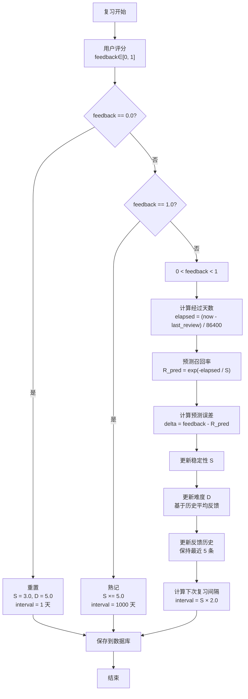
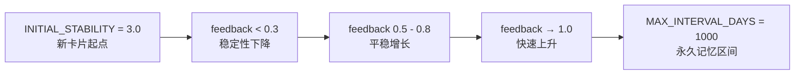

# SRS 复习算法 — SDR 记忆度量模型

> 本文档描述 Smart Error Notebook 使用的间隔重复复习算法，基于 **SDR（Stability-Difficulty-Retrievability）** 连续反馈模型。

---

## 📑 目录

1. [概述](#-概述)
2. [核心公式](#-核心公式)
3. [算法流程](#-算法流程)
4. [参数详解](#-参数详解)
5. [反馈映射指南](#-反馈映射指南)
6. [调参指南](#-调参指南)
7. [与 SM-2 的对比](#-与-sm-2-的对比)
8. [代码结构](#-代码结构)

---

## 📖 概述

传统的间隔重复系统（如 Anki 的 SM-2 算法）使用离散的评分等级，而本系统采用 **SDR 模型**，核心思想是：

1. **稳定性 (Stability, $S$)**：记忆能持续多久（天），$S$ 越大，遗忘越慢
2. **难度 (Difficulty, $D$)**：题目的固有难度，$D$ 越大，稳定性增长越慢
3. **可提取度 (Retrievability, $R$)**：当前时刻回忆起来的概率

三者关系：**稳定性** 和 **难度** 是系统内部状态，**可提取度** 是用户可感知的预测值。

---

## 📐 核心公式

### 遗忘曲线

$$R = e^{-t / S}$$

- $R$：预测召回率，范围 $(0, 1]$
- $t$：距离上次复习的时间（天）
- $S$：稳定性（天）

当 $t = S$ 时，$R = e^{-1} \approx 0.368$，即约 37% 的几率记得。

### 稳定性更新

$$S_{\text{new}} = S \cdot \text{clamp}\left(1 + \eta_S \cdot \delta \cdot \frac{10}{D},\ \text{MIN\_S\_FACTOR},\ \text{MAX\_S\_FACTOR}\right)$$

其中：
- $\eta_S = 0.3$：稳定性学习率
- $\delta = \text{feedback} - R_{\text{pred}}$：预测误差（反馈 $-$ 预测）
- $\frac{10}{D}$：难度敏感度——难度越高，稳定性对反馈越不敏感
- $\text{clamp}$ 将因子限制在 $[0.5, 5.0]$ 之间

### 难度更新

难度不随单次反馈剧烈变化，而是基于最近 5 次反馈的**滑动平均**：

$$D_{\text{new}} = \text{clamp}\left(D + \eta_D \cdot (0.5 - \bar{f}),\ 1.0,\ 10.0\right)$$

其中：
- $\eta_D = 0.05$：难度学习率
- $\bar{f}$：最近 5 次反馈的平均值
- $0.5 - \bar{f}$：反馈偏置——平均反馈 > 0.5 降低难度，< 0.5 增加难度

### 复习间隔

$$\text{interval} = \text{ceil}(\max(S \cdot 2.0,\ 1.0))$$

间隔至少 1 天，最多 1000 天。

---

## 🔄 算法流程



---

## ⚙️ 参数详解

所有参数集中在 `src-tauri/src/srs/mod.rs` 的 `config` 模块中：

| 参数名 | 值 | 含义 | 影响 |
|--------|:--:|------|------|
| `ETA_S` | `0.3` | 稳定性学习率 | 越大，单次反馈对稳定性的影响越大 |
| `ETA_D` | `0.05` | 难度学习率 | 越大，难度随历史反馈变化越快 |
| `MAX_S_FACTOR` | `5.0` | 稳定性最大放大倍数 | 单次复习最多让稳定性增长 5 倍 |
| `MIN_S_FACTOR` | `0.5` | 稳定性最小缩小比例 | 单次复习最多让稳定性缩小一半 |
| `INITIAL_STABILITY` | `3.0` | 初始稳定性（天） | 新错题默认 3 天复习一次 |
| `INITIAL_DIFFICULTY` | `5.0` | 初始难度 | 新卡片默认中等难度 |
| `MIN_DIFFICULTY` | `1.0` | 难度下限 | 最简单的题目 |
| `MAX_DIFFICULTY` | `10.0` | 难度上限 | 最难的题目 |
| `MAX_INTERVAL_DAYS` | `1000` | 最大复习间隔 | 超过视为永久记忆 |
| `FEEDBACK_HISTORY_LEN` | `5` | 反馈历史长度 | 滑动窗口大小 |
| `INTERVAL_COEFFICIENT` | `2.0` | 间隔系数 | 间隔 = S × 2.0 |

### 参数的可视化影响



---

## 🎯 反馈映射指南

评分滑块的范围是 $[0.0, 1.0]$，对应关系：

| 评分 | 用户感受 | 算法行为 |
|:----:|----------|----------|
| **0.0** | 完全忘了，一点都想不起来 | **重置卡片**。$S$ 回到 3.0，$D$ 回到 5.0，明天再复习 |
| **0.2** | 几乎想不起，给提示才能回忆 | 稳定性大幅下降（×0.5），难度略增 |
| **0.4** | 有点印象，但答错了 | 稳定性略微下降，难度增加 |
| **0.5** | 模棱两可，半对半错 | 稳定性基本不变 |
| **0.6** | 想起来了，但不太确定 | 稳定性略微增长 |
| **0.8** | 基本记得，答对了 | 稳定性明显增长（约 ×1.5~2） |
| **1.0** | 滚瓜烂熟，秒答 | **视为熟记**。$S$ ×5，间隔设为 1000 天 |

### 评分建议

- **诚实评分**：基于你真实的感觉，而不是"应该记得"
- **及时评分**：在看答案之前先评估自己的记忆
- **一致评分**：对同类型题目保持相近的评分标准

---

## 🔧 调参指南

> 调参需要修改 Rust 代码并重新编译。

### 场景：想降低复习频率

```rust
// 增大间隔系数，让间隔更长
pub const INTERVAL_COEFFICIENT: f64 = 3.0;  // 从 2.0 改为 3.0

// 增大稳定性学习率，让正向反馈更快增长
pub const ETA_S: f32 = 0.5;  // 从 0.3 改为 0.5
```

### 场景：想让新卡片更快进入复习周期

```rust
// 降低初始稳定性
pub const INITIAL_STABILITY: f32 = 1.0;  // 从 3.0 改为 1.0
```

### 场景：对难题更宽容

```rust
// 降低难度学习率，让难度不轻易升高
pub const ETA_D: f32 = 0.02;  // 从 0.05 改为 0.02

// 提高稳定性最小缩放因子，即使忘记也不会掉太多
pub const MIN_S_FACTOR: f32 = 0.7;  // 从 0.5 改为 0.7
```

### 场景：对简单题快速提升间隔

```rust
// 增大最大放大倍数
pub const MAX_S_FACTOR: f32 = 8.0;  // 从 5.0 改为 8.0
```

---

## ⚖️ 与 SM-2 的对比

| 特性 | SM-2（Anki 经典算法） | SDR（本系统） |
|------|----------------------|---------------|
| 反馈粒度 | 离散 0-5（6 级） | 连续 $[0, 1]$ |
| 难度参数 | 固定，人工设定 | 自适应，基于历史反馈 |
| 稳定性增长 | 查表（ease factor） | 公式计算 |
| 遗忘曲线 | $R = e^{-t/S}$ 类似 | $R = e^{-t/S}$ |
| 参数数量 | 3-4 个 | 11 个 |
| 适合场景 | 通用学习 | 错题复习 |

### 为什么选择 SDR

错题复习和一般记忆卡片有本质区别：
- 错题需要更精细的反馈（不是"记得/不记得"二元，而是"部分记得"）
- 错题的难度差异极大，需要自适应难度
- 学生需要在考试前密集复习，SDR 的连续反馈能更好地压缩/扩展间隔

---

## 📁 代码结构

算法代码集中在一个文件中：

- **`src-tauri/src/srs/mod.rs`** — 核心算法，纯 Rust，无外部依赖

### 核心函数

| 函数 | 输入 | 输出 | 说明 |
|------|------|------|------|
| `review_card()` | `card`, `now`, `feedback` | `ReviewResult` | 主入口，处理一次复习 |
| `predict_retrievability()` | `stability`, `elapsed_days` | `f32` | 计算预测召回率 $R$ |
| `compute_next_interval()` | `stability` | `i64` | 计算下次复习间隔（天） |
| `days_elapsed()` | `last_review_at`, `now` | `f64` | 计算经过天数 |
| `update_feedback_history()` | `history_json`, `feedback` | `String` | 维护反馈历史 |
| `avg_feedback_history()` | `history_json` | `f32` | 计算历史平均反馈 |


---

> 算法相关的问题或改进建议，请提交 [GitHub Issue](https://github.com/zpb911km/SmartErrorNotebook/issues)
