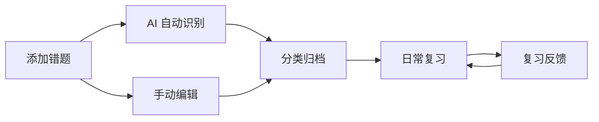

# Smart Error Notebook 用户手册

> 让每一次错误，都成为进步的阶梯

---

## 📑 目录

1. [安装与启动](#-安装与启动)
2. [快速上手](#-快速上手)
3. [添加错题](#-添加错题)
4. [管理错题](#-管理错题)
5. [智能复习](#-智能复习)
6. [数据导入导出](#-数据导入导出)
7. [多设备同步](#-多设备同步)
8. [错题社区](#-错题社区)
9. [设置](#-设置)
10. [常见问题](#-常见问题)

---

## 📥 安装与启动

### 系统要求

| 平台 | 最低版本 |
|------|----------|
| Windows | Windows 10 1809+ |
| Linux | glibc 2.28+ (Ubuntu 20.04+, Fedora 36+) |
| Android | Android 8.0 (API 26+) |

### 下载安装包

从项目的 **Releases** 页面下载对应平台的安装包：

| 平台 | 安装包格式 |
|------|------------|
| **Windows** | `.msi` 或 `.exe` 安装程序 |
| **Linux** | `.deb` / `.AppImage` / `.rpm` |
| **Android** | `.apk` |

> **Android 用户注意**：首次安装后需在系统设置中授予**相机权限**（拍照录入）和**存储权限**（导出文件），应用会在首次使用时自动请求。

### 从源码构建

**桌面端：**

```bash
# 前置要求
# - Rust toolchain (rustup)
# - Node.js ≥ 18
# - pnpm (npm install -g pnpm)

git clone https://github.com/zpb911km/SmartErrorNotebook.git
cd SmartErrorNotebook
pnpm install

# 开发模式
pnpm tauri dev

# 构建发布包
pnpm tauri build
```

**Android 端：**

```bash
# 额外要求：Android SDK 34+、NDK 26+
# 可通过 Android Studio 安装，或参考 Tauri 官方文档

pnpm tauri android init     # 初始化 Android 项目（首次）
pnpm tauri android dev      # USB 连接设备运行
pnpm tauri android build    # 生成 APK/AAB
```

### 首次启动

1. 建议先进入 **设置** → **AI 配置**，填入你的 LLM 接口信息（可选，不使用 AI 也可手动录入）
2. 如果需要, 在 **同步页** 中配置服务器信息

---

## 🚶 快速上手



**典型工作流：**

1. **拍照/选图** → 应用自动识别题目内容
2. **确认信息** → 补充科目、来源、错因标签
3. **日常复习** → 首页查看待复习卡片，按提示回忆
4. **反馈评分** → 每次复习后滑动评分，算法自动调整间隔

---

## 📸 添加错题

进入 **添加** 页面（底部导航栏 "+" 图标）。

### 方式一：拍照录入

1. 点击 **拍照** 按钮（需授予相机权限）
2. 对准题目拍照
   - **桌面端**：调用系统摄像头
   - **Android 端**：调用系统摄像头
3. 裁剪/调整图片（支持旋转、缩放）
4. 点击确认，图片将进入处理流程

### 方式二：选择图片

1. 点击 **选择文件** 按钮
2. 从文件管理器中选择题目截图/照片

### 方式三：AI 自动识别

> 前置条件：已在设置中配置 LLM 接口

1. 图片上传后，点击 **AI 查询** 按钮
2. 系统将图片发送给 LLM，自动提取：
   - **题干**（prompt）
   - **标准答案**（answer）
   - **解析**（analysis）
   - **题型**（type）
3. 识别结果自动填入表单，可手动修改

### 手动编辑

在 AI 识别后或直接手动填写：

| 字段 | 说明 | 必填 |
|------|------|:----:|
| 题干 | 题目内容，支持 Markdown + LaTeX 公式 | ✅ |
| 题型 | 单选题/多选题/判断题/简答题/填空题/论述题/计算题 | ✅ |
| 科目 | 从已有科目中选择 | ✅ |
| 标准答案 | 参考答案，支持 Markdown | 可选 |
| 解析 | 题目解析，支持 Markdown | 可选 |
| 错题笔记 | 自己的反思记录 | 可选 |
| 来源 | 书 → 章节 → 知识点 三级分类 | 可选 |
| 错因标签 | 自定义标签，如"粗心""概念不清"等 | 可选 |
| 附件图片 | 原始题目图片/答案图片 | 可选 |

> **Markdown + LaTeX 支持**：题干、答案、解析等字段均支持 Markdown 语法和 `$...$` / `$$...$$` LaTeX 数学公式。

### 错因标签

- 创建错题时可为题目添加错因标签
- 标签可自定义名称和颜色
- 支持同时选择多个标签
- 标签可在管理页面统一管理

---

## 📂 管理错题

进入 **管理** 页面查看所有错题。

### 搜索与筛选

- **关键词搜索**：模糊匹配题干、科目、书名、知识点
- **科目筛选**：支持级联菜单，选择科目后可进一步筛选书 → 章节
- **题型筛选**：按题型分类浏览

### 错题列表

每张卡片显示：
- 题干摘要
- 题型标签
- 科目 + 来源信息
- 错因标签（彩色小方块）
- SRS 复习状态

### 编辑错题

点击任意错题进入详情页，可修改：
- 题干、答案、解析、错题笔记
- 科目、来源
- 错因标签
- 附件图片（新增/删除）

---

## 🧠 智能复习

本系统采用 **SDR（Stability, Difficulty, Retrievability）** 记忆模型，基于连续反馈自适应调整复习计划。

### 基本原理

$$R = e^{-t/S}$$

- $R$：预测召回率（0~1），1 表示完全记得
- $t$：距离上次复习的时间（天）
- $S$：稳定性（天），表征记忆强度

复习反馈越积极，稳定性增长越快，下次复习间隔越长。

### 开始复习

1. 进入 **复习** 页面
2. 可先筛选科目/来源（可选）
3. 点击 **开始复习**，系统按优先级展示待复习题目
4. 每道题：
   - 先看题目，在脑海中回忆答案
   - 点击 **显示答案** 核对
   - 滑动评分器给出反馈

### 评分标准

| 评分 | 0.0 | 0.2 | 0.4 | 0.6 | 0.8 | 1.0 |
|------|:---:|:---:|:---:|:---:|:---:|:---:|
| 感觉 | 完全忘了 | 几乎想不起 | 有点印象 | 想起来了 | 基本记得 | 滚瓜烂熟 |
| 间隔变化 | 重置为短间隔 | 略微缩短 | 保持 | 略微延长 | 明显延长 | 超长间隔 |

- 评分 **0.0**：重置卡片，视为全新，明天再复习
- 评分 **1.0**：视为熟记，间隔延长至上限（1000 天）
- 中间值：连续调节稳定性和难度参数

### 复习统计

在 **个人主页** 页面可查看：
- 错题总数
- 待复习数量
- 复习趋势图表

---

## 📤 数据导入导出

### 导出

支持三种导出格式：

| 格式 | 特点 | 用途 |
|------|------|------|
| **HTML** | 美观排版，含公式渲染 | 打印、分享 |
| **JSON** | 结构化数据 | 备份、迁移 |

导出选项：
- 可选择是否包含答案和解析
- 可筛选特定科目导出

**移动端分享（Android）：**

在 Android 设备上，不仅导出到本地，还可以通过 **分享按钮** 调用系统分享：
- JSON / HTML 文件可一键分享到微信、QQ、邮件等
- 底层使用 Android 的 `Intent` 系统 + Tauri Share Plugin 实现
- 桌面端自动隐藏分享按钮（无系统分享上下文）

> 此功能依赖 `navigator.share()` Web Share API 和 Tauri 的 `share:allow-share-file` 权限。

### 导入

支持导入 JSON 格式数据：
- 点击 **导入** 按钮
- 选择 JSON 文件
- 系统会自动去重（同内容跳过）

---

## 🔄 多设备同步

> 同步功能需要自行部署同步服务器，或连接到已部署的服务器。

### 服务器部署

```bash
cd server
pip install -r requirements.txt

# 启动（默认 SQLite）
python app.py
```

服务器默认运行在 `http://localhost:5000`。

### 获取授权码

1. 访问 `http://your-server:5000/admin`
2. 在管理页面生成一个新的 `auth_key`
3. 复制授权码

### 配置同步

1. 在应用内进入 **同步** 页面
2. 填写服务器地址（如 `http://192.168.1.100:5000`）
3. 填写授权码
4. 点击 **测试连接** 验证
5. 开启自动同步（可选）

### 同步机制

- **离线优先**：所有数据先保存在本地，有网络时同步
- **握手协议**：客户端与服务端通过握手比对版本号，确定双向传输内容
- **冲突解决**：当多设备同时修改同一记录时，会提示用户手动解决冲突

> 同步协议的详细设计见 [同步协议文档](SYNC_PROTOCOL.md)

---

## 🌐 错题社区

### 分享错题

1. 在错题详情页点击 **分享** 按钮
2. 系统将题目分享到社区（不含个人信息）
3. 其他用户可浏览你分享的题目

### 浏览社区

- 进入 **社区** 页面查看他人分享的错题
- 可按时间排序浏览
- 点击可查看详细内容

---

## ⚙️ 设置

### 外观

| 设置 | 选项 |
|------|------|
| 主题 | 浅色 / 深色 / 跟随系统 |

### AI 配置

本应用兼容任何兼容 **OpenAI API 格式** 的 LLM 服务：

| 参数 | 说明 | 示例 |
|------|------|------|
| 接口地址 | API 基础 URL | `https://api.openai.com` |
| API Key | 密钥 | `sk-...` |
| 模型名 | 模型标识 | `gpt-4o`, `deepseek-chat` |
| 系统提示词 | 自定义 AI 行为（可选） | — |

支持的模型推荐：
- OpenAI: `gpt-4o`, `gpt-4o-mini`
- DeepSeek: `deepseek-chat`
- 任何兼容 OpenAI 格式的本地/云端模型

### LLM 测试

配置完成后，可在设置页点击 **测试** 按钮验证 LLM 是否正常工作。

### 导出设置

- **HTML 导出包含答案和解析**：开关控制导出时是否包含参考答案和解析内容

---

## ❓ 常见问题

### Q: 数据存在哪里？会不会丢失？

所有数据存储在本地 SQLite 数据库中，位置：
- **Windows**: `%APPDATA%/com.zlzo.smarterrornotebook/`
- **macOS**: `~/Library/Application Support/com.zlzo.smarterrornotebook/`
- **Linux**: `~/.local/share/com.zlzo.smarterrornotebook/`

建议定期通过 **导出 → JSON** 备份数据。如果开启了同步，数据还会备份到服务器。

### Q: 如何迁移数据到新设备？

1. 旧设备：导出 JSON
2. 新设备：安装应用 → 导入 JSON
3. 如果使用同步功能，直接在新设备配置相同 auth_key 即可同步

### Q: AI 识别不准怎么办？

- 确保图片清晰、文字可辨
- 可在设置中调整 LLM 的系统提示词
- 识别结果可手动修改

### Q: 复习卡片太多，怎么办？

- 使用筛选功能只复习特定科目
- 坚持复习，算法会自动将熟练的卡片间隔拉长
- 对于彻底掌握的题目，可在详情页删除

### Q: 如何完全重置数据？

删除本地数据库文件（见数据位置），或重新安装应用。

### Q: Android 上拍照不能用怎么办？

- 检查是否授予了相机权限（设置 → 应用 → 智能错题本 → 权限 → 相机）
- 部分定制 Android 系统（MIUI/EMUI 等）可能需要额外在权限管理中开启"允许悬浮窗"或"允许后台弹出界面"
- 如果系统相机无法启动，可改用 **选择文件** 方式从相册选取图片

### Q: Android 和桌面端可以同步吗？

可以。同步服务器是平台无关的，Android 设备和桌面端配置同一个服务器地址和 `auth_key` 即可双向同步。

### Q: Android 端支持在后台同步吗？

当前版本在应用打开或手动触发同步时进行数据交换。Android 端的后台定时同步功能计划在后续版本中加入。

---

> 更多问题或建议，请提交 [GitHub Issue](https://github.com/zpb911km/SmartErrorNotebook/issues)
